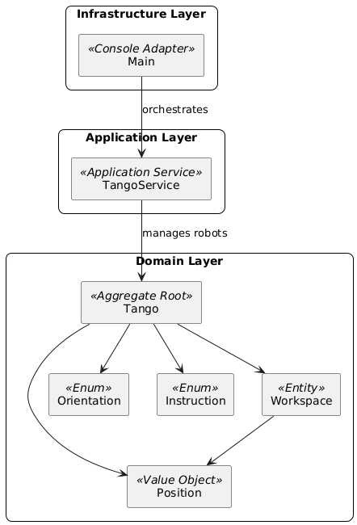

# Tango - The Autonomous Cleaning Robots

Author: Joan Viso (joan.viso@gmail.com)

## Why "Tango"?

I believe giving a project its own name is always a nice detail, even if it’s just a small test.  
Inspired by existing cleaning robots like Roomba (from rumba) and Conga, I chose Tango: a dance known for precision, coordination, and elegance. Qualities expected from a cleaning robot in industrial spaces such as Volkswagen factories.

## Technology

This project is implemented with Java 17, a LTS version, to ensure stability, performance, and with all the needed features for this simple challenge. I chose Java and Maven because they are solid, widely used tools I’m experienced with, and they simplify project management and testing.

I decided not to use frameworks like Spring, as the challenge does not require web APIs, persistence, or complex configuration. Keeping the project lightweight and focused on core domain logic makes it easier to maintain and review.

#### Requirements
- Java 17 or higher installed
- Apache Maven 3.8+ installed

## AI Usage

Yes, I have used AI in this project. Firstly, because specifications didn't say the opposite. Secondly, in today’s world, a developer who doesn’t leverage AI is like running a race on foot while everyone else drives a motorbike.

However, using AI doesn’t mean blindly following its suggestions. Every line of code I’ve written is something I understand, find correct, and can justify. I discarded several proposals of the AI, for example, the AI suggested adding a controller, but I chose not to, as it wouldn’t fit the simplicity and command-focused approach of this small project.

## Design and Technical Decisions

### Domain Model Decision

While a rich domain model has clear advantages, encapsulating rules directly in the entities, reducing the risk of inconsistent state, and keeping business logic close to the data, in this implementation I deliberately separated responsibilities between the domain and the application entry point (Main).

The parsing of input data (workspace size, robot positions, and instruction strings) and the orchestration of the execution flow are handled in the Main class. The domain model itself remains focused exclusively on representing robots, their positions, and the rules governing their movement within the workspace.

This design choice has several benefits:

* *Separation of Concerns*: Input parsing and user interaction are not domain responsibilities. Mixing them into the model would couple the domain logic with specific input formats, reducing flexibility.
* *Reusability and Testability*: By isolating parsing and orchestration in Main (and delegating execution to TangoService), the domain classes remain agnostic of how data is provided. This makes them easier to reuse in other contexts (e.g., REST API, batch processing, or integration with external systems) and far easier to unit test.
* *Flexibility for Future Extensions*: If the source of instructions changes (e.g., from console input to JSON, files, or a web request), no modification is required in the domain model. Only the parsing layer would adapt, keeping the core logic intact.
* *Maintainability*: The current approach enforces a clear boundary between infrastructure concerns (I/O, parsing, orchestration) and the domain logic. This makes the codebase easier to reason about and maintain over time.

In summary, although rich domain models are valuable, in this case keeping parsing and orchestration outside the domain ensures cleaner boundaries, greater reusability, and easier long-term maintainability, while the domain remains focused on enforcing business rules and movement logic.

### Domain-Driven Design (DDD) and Hexagonal Architecture



This implementation already follows several tactical patterns from Domain-Driven Design and aligns conceptually with Hexagonal Architecture principles:

#### 1. Clear separation of layers
  - The domain.model package contains the core domain logic: entities (Tango, Position, Workspace), and domain concepts modeled as enums (Instruction, Orientation).
  - The application.service package (TangoService) orchestrates domain objects without embedding domain logic itself. This matches the DDD concept of an application service: coordinating use cases while leaving the rules to the domain layer.
  - The infrastructure and I/O (parsing console input, printing results) are kept in Main, outside the domain, following the Hexagonal idea of separating adapters from the core.

#### 2. Ubiquitous Language

Concepts like Tango, Workspace, Position, Instruction, and Orientation are explicitly represented in the model, reflecting the problem domain in code.
This makes the code easy to reason about for both developers and domain experts.

#### 3. Hexagonal Architecture alignment

The domain layer is completely isolated from external concerns: it has no dependency on console I/O, files, or frameworks.
If tomorrow the robots were controlled via a REST API, a file parser, or a GUI, only a new adapter would be required, the domain model and application service would remain unchanged.

#### 4. Extensibility and testability

Because domain rules are centralized in the model and parsing/orchestration are separated, unit testing the domain is straightforward.
Future extensions (e.g., new instruction types, persistence adapters, different input formats) can be added without changing the core domain logic.

### Rich Domain Model Elements

Even though input parsing and orchestration are handled outside the domain, the core business logic is fully encapsulated within the domain objects. This ensures that rules are consistently enforced and that the model itself is expressive, cohesive, and reusable.

* **Orientation**:
Encapsulates all rotation logic (turnLeft, turnRight) and parsing from characters. This ensures orientation-related behavior is always handled consistently and avoids spreading switch/case logic throughout the code.
* **Position**:
Encapsulates the logic for moving forward based on the current orientation, equality checks, and hash-based comparison for workspace collision detection. This makes positions first-class domain citizens rather than raw (x,y) pairs.
* **Workspace**:
Responsible for validating whether positions are inside the allowed boundaries and whether collisions occur. This prevents invalid robot states and centralizes all spatial rules in one place.
* **Tango (Robot Aggregate)**:
The Tango class models a robot as an aggregate root:
  - It owns its Position, Orientation, and pending Instructions.
  - It enforces rules when moving (delegating validation to the Workspace).
  - It prevents illegal state transitions by rejecting invalid moves (via exceptions).
  - It executes instructions sequentially, encapsulating robot behavior in a single unit.

This makes the domain model rich in behavior, not just a collection of data structures.

### Robot's Instructions Execution
As the instructions execution for each robot is sequential, I opted for a simple approach where each robot processes all its instructions one by one but with a single method. This design choice simplifies the logic and avoids the complexity of concurrent execution, which is not necessary for this challenge.

### Using Exceptions for Invalid Moves

Changing my original approach, the final version throws an exception when a robot attempts to move outside the defined boundaries or into an already occupied position, instead of silently ignoring the move.

This design choice was made for the following reasons:

* It makes errors explicit rather than hiding them, so the user of the robot immediately knows that something went wrong.
* Exceptions provide a clear stack trace, which helps identify the cause of the issue more quickly than simply observing that a robot did not move.
* Handling exceptions allows different strategies (e.g., retry, skip, or stop execution) without changing the core movement logic.

## Not required features

I have decided to go a little beyond the initial requirements and implement collision validation between robots to ensure a more robust and functional prototype. By encapsulating this logic in the domain layer, specifically within the Workspace class, the system not only prevents robots from moving out of bounds but also stops them from occupying the same position simultaneously.

In a real-world environment, system integrity would be critical, and this validation, while not an explicit requirement of the test, makes the prototype a more reliable and coherent solution that more realistically simulates the behavior of a robot control system.


## Build and Run Instructions

### Compile the project
To compile the source code, run:
```
mvn clean compile
```

### Run the tests
The project includes both unit tests and integration tests:

* Unit tests focus on the domain model (Tango, Workspace, Position, etc.), ensuring that business rules such as movement, orientation changes, and workspace validation behave correctly in isolation.

* Integration tests validate the end-to-end behavior through the TangoService.
They simulate complete scenarios where robots are created, loaded with instructions, and executed within a workspace.
These tests ensure that all components interact properly and that the final positions and orientations match the expected results.

To execute the unit tests:
```
mvn test
```

### Package the application
To build the JAR package:
```
mvn clean package
```

### Run the application
The resulting artifact will be located in the target/ directory, for example:
*target/tango-1.0.0.jar*

To run the packaged application, execute:
```
java -jar target/tango-1.0.0.jar
```

**IMPORTANT:**

During execution, messages are printed to the console to guide you through the process.
But you can either enter the input line by line, or paste all lines at once.

Once all robots have been entered, press **CTRL+Z (Windows) or CTRL+D (Linux/macOS) and then ENTER** to signal the end of input.